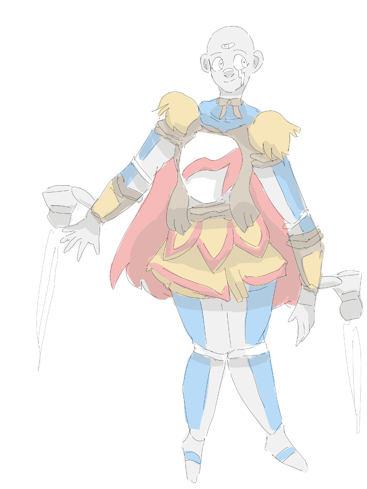

+++
author = "Sabbyblue"
title = "Original Character Showcase: Primus Machina"
description = ""
tags = [
    "art",
]
image = "primus.png"
+++
  

# A machinic woman from the future, sent onto the past to amend our wrongs.

She's one of my latest characters.

It is said that she was a personal assistant bot who found herself flung onto a **time vortex** of unknown destination. She wound up in prehistoric Europe, where she will alter the timeline by teaching the nearby settlements about modern science and technology.She shall be revered for her advancements and role in the founding of the first civilization, the Primal people.
